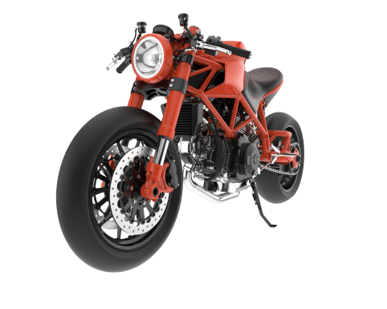

Describe :

**Navbar অংশ**
<nav class="navbar bg-[#264653] shadow-lg backdrop-blur-sm">

navbar → DaisyUI এর ক্লাস, এটাকে navbar বানায়।

bg-[#264653] → TailwindCSS দিয়ে ব্যাকগ্রাউন্ড রঙ দেওয়া হয়েছে (#264653 – গাঢ় সবুজাভ নীল)।

shadow-lg → Navbar এ শ্যাডো যোগ করছে।

backdrop-blur-sm → ব্যাকগ্রাউন্ডের জিনিসগুলোকে সামান্য blur করে।

🔹 Navbar তিন ভাগে ভাগ করা হয়েছে:

navbar-start

  

👉 এখানে সাধারণত Logo বা ব্র্যান্ড নাম বসানো হয়।

text-white → লেখা সাদা।

font-bold text-xl → মোটা এবং বড় ফন্ট।

navbar-center

  <ul class="menu menu-horizontal px-1 space-x-2">
    <li><a class="text-white">Home</a></li>
    <li><a class="text-white">Shop</a></li>
    <li><a class="text-white">News</a></li>
    <li><a class="text-white">Contact</a></li>
  </ul>

👉 এখানে মূল Navigation Links রাখা হয়েছে।

hidden lg:flex → ছোট স্ক্রিনে হাইড হবে, কেবল বড় স্ক্রিনে (lg+) Flexbox আকারে দেখাবে।

menu menu-horizontal → DaisyUI এর মেনু লিস্ট, অনুভূমিকভাবে সাজানো।

space-x-2 → প্রতিটি লিঙ্কের মধ্যে সামান্য গ্যাপ।

navbar-end

  
 ... 

  <button class="btn bg-[#E76F51] text-white border-none btn-animated mr-32">
    Login
  </button>

👉 এখানে দুটি জিনিস আছে:

Dropdown menu → ছোট স্ক্রিনে (lg:hidden) মেনু দেখানোর জন্য একটি হ্যামবার্গার মেনু।

Login Button → ডান পাশে লাল-কমলা (#E76F51) রঙের একটি বাটন।

****Hero Section : ****

Hero Section
<section class="hero bg-[#264653] hero-pattern min-h-screen">
  

hero → DaisyUI এর Hero সেকশন।

bg-[#264653] → Hero ব্যাকগ্রাউন্ড গাঢ় সবুজাভ নীল।

hero-pattern → (সম্ভবত কাস্টম CSS ব্যাকগ্রাউন্ড pattern যোগ করতে ইউজ হয়েছে)।

min-h-screen → Hero সেকশন পুরো স্ক্রিনের উচ্চতা নেবে।

flex-col lg:flex-row-reverse → মোবাইলে column layout, কিন্তু বড় স্ক্রিনে row-reverse (ডান দিকে ছবি, বাম দিকে টেক্সট)।

max-w-7xl → কন্টেন্টকে সর্বোচ্চ প্রস্থ 7xl পর্যন্ত সীমাবদ্ধ করছে।

👉 Hero Content ভিতরে দুই ভাগ:

Image (ডানপাশে)

  

flex-1 → Flexbox এ সমান প্রস্থ নেবে।

max-w-full h-auto → ছবি রেসপনসিভ হবে।

Text (বামপাশে)

  
 ... 

  <h1 class="text-4xl md:text-6xl font-bold text-white mb-6">Honda CBR 300R</h1>
  
 ... 

  <button class="btn bg-[#E76F51] text-white border-none btn-animated px-8 py-3 text-lg">
    Purchase Now
  </button>

ছোট স্ক্রিনে text-center, বড় স্ক্রিনে text-left।

Honda CBR 300R বড় হেডিং হিসেবে সাদা রঙে দেখাবে।

একটা বর্ণনা প্যারাগ্রাফ দেওয়া আছে ধূসর রঙে।

শেষে Purchase Now বাটন (#E76F51 রঙের)।

**Whole part1 :**
উপরে একটা Navbar আছে (বামদিকে লোগো, মাঝখানে মেনু, ডানদিকে Login বাটন + ছোট স্ক্রিনে Dropdown)।

এর নিচে একটা Hero Section আছে (ডানদিকে বাইক এর ছবি, বামদিকে লেখা এবং বাটন)।
